<div align="center">
  <br />
    <a href="#" target="_blank">
      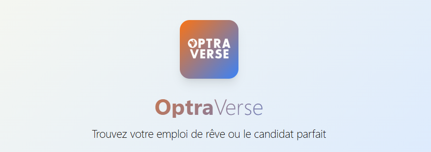
    </a>
  <br />

   <div align="center">
     Watch simulations of various attack types to understand threat behaviors and see our solution in action in <a href="#" target="_blank"><b>this video</b></a>
    </div>
     
</div>
<br/>
<p align="center">

  <!-- Frontend -->
  
  
  
  
  
  
  

  <!-- Backend -->
  
  
  
  
  

  <!-- AI / LLM -->
  
  
  
  
  
  
  

  <!-- NLP / Utils -->
  
  
  
  
  

  <!-- Data -->
  
  

  <!-- Streaming / UI -->
  

  <!-- Frontend 3D / Web -->
  
  

  <!-- Security / Auth -->
  

  <!-- Tools -->
  
  
  
  

  <!-- OS -->
  

  <!-- Comments -->
  

</p>


# 🌐 Optra Verse – AI‑Driven Career Empowerment Platform
> Empowering job seekers in **Sub-Saharan Africa** & **MENA** with AI-powered career tools.

<div align="center">
  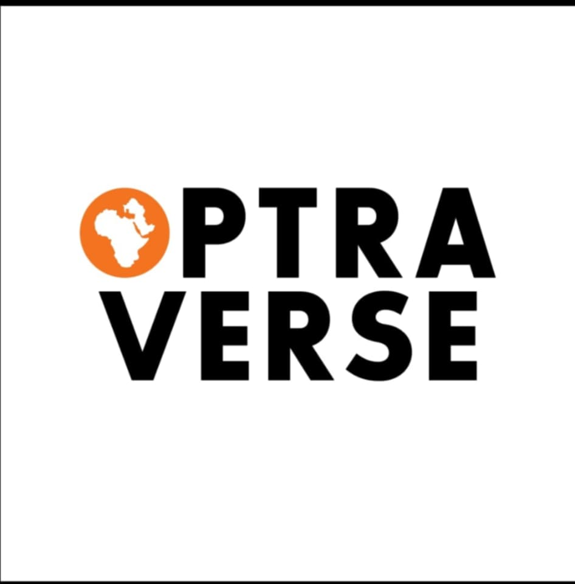
   <br/>
  <figcaption>Logo OptraVerse</figcaption>
</div>

---

## 🌟 Overview
**Optra Verse** is a modern AI-powered career development platform designed to help job seekers in **Sub-Saharan Africa** and **MENA**:

- Optimize resumes with AI suggestions  
- Prepare for interviews with AI-guided mock sessions  
- Match with relevant job opportunities  
- Manage multilingual profiles (Arabic, French, English)  
- Navigate a responsive, modern user interface  
**Tech Stack:**  
- **Frontend:** React + TypeScript + Vite  
- **Backend:** Laravel + MySQL  
- **Security:** HTTP-only cookies, access/refresh tokens, middleware-protected APIs
- 
**Core Goals:**
1. Help candidates **land the right job faster**  
2. Assist recruiters in **finding the right talent efficiently**  
3. Bridge the gap between skills and job market requirements  
---


## 🎯 Key Features

| Feature | Description |
|---------|-------------|
| **AI Resume Enhancement** | Smart CV optimization and suggestions |
| **Job Matching Algorithm** | Personalized job recommendations based on skills & profile |
| **AI Interview Preparation** | Mock interviews with intelligent AI feedback |
| **Multi-language Support** | Arabic, French, English |
| **Progressive Web App** | Installable, offline-ready, app-like experience |
| **Role-based Access** | Tailored experiences for Job Seekers, Recruiters, and Admins |

---

## 🏗 Technology Stack

### Frontend
- **Framework:** React 19.1.1 + Vite + TypeScript  
- **Styling:** Tailwind CSS + shadcn/ui  
- **Animations:** Framer Motion  
- **Icons:** Lucide React  
- **State Management:** Redux + Redux Persist  
- **Routing:** React Router DOM  
- **Theming:** Next-Themes (Dark/Light Mode)  
- **PWA Support:** Service Worker, Offline Ready  
- **Internationalization (i18n):** English, French, Arabic  

<div align="center">
  
   <br/>
  <figcaption>Frontend Architecture & Tech Stack</figcaption>
</div>

### Backend
- **Framework:** Laravel 11  
- **Database:** MySQL  
- **Authentication:** JWT (Access & Refresh Tokens) via Tymon JWT  
- **Security:** HTTP-only Cookies, Middleware Protection  
- **Storage:** Laravel Storage with Hashing  
- **Notifications:** Email Services  
- **Validation:** RequestStore Input Validation  

---

## 🔐 Authentication & Security
- Role-based login/signup: Job Seeker, Recruiter, Admin  
- Email verification required before account access  
- Forgot / Reset password flows  
- **JWT Authentication:**  
  - Access Token: 2 days  
  - Refresh Token: 10 days  
  - Stored in **HTTP-only cookies**  
- Middleware-based role access control  
- Secure API endpoints & CSRF-safe communication  

<div align="center">
  
     <br/>
  <figcaption>Login Workflow</figcaption>
</div>

<div align="center">
  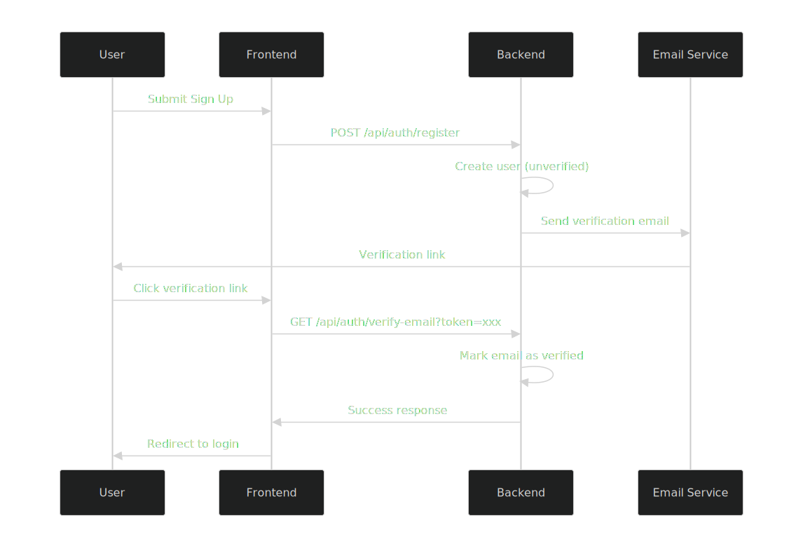
     <br/>
  <figcaption>SignUp Sequence Diagram</figcaption>
</div>

<div align="center">
  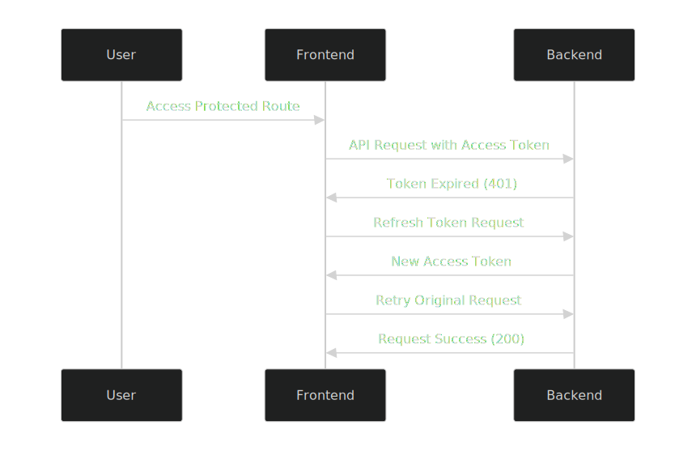
     <br/>
  <figcaption>Access Token Mechanism</figcaption>
</div>

<div align="center">
  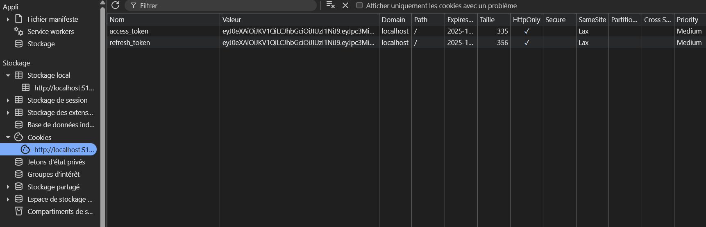
     <br/>
  <figcaption>Access & Refresh Tokens in Cookies</figcaption>
</div>

<div align="center">
  
     <br/>
  <figcaption>Email Verification Flow</figcaption>
</div>

---

## ✔ Progressive Web App (PWA)
- Installable on Android, iOS, Desktop  
- Custom service worker for offline support  
- Splash screen + onboarding with swipe navigation  

<div align="center">
  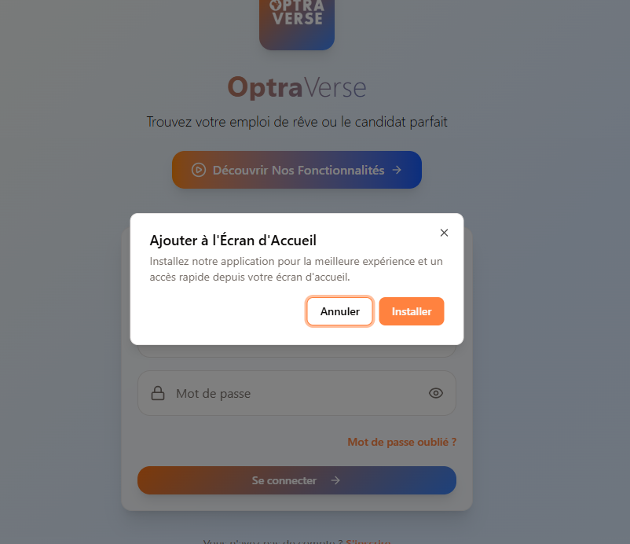
     <br/>
  <figcaption>PWA Experience</figcaption>
</div>

---

## 🧠 AI Features (Job Seeker Dashboard)
1. **AI Resume Enhancer** – Upload, edit, and optimize resumes  
2. **Job Matcher** – Matches jobs based on skills & profile  
3. **AI Mock Interview** – Interactive Q&A with feedback  
4. **Profile Completion** – Visual completion tracker  
5. **Account Settings** – Update password, profile, resume  

---


## 💬 Community Feedback & Comments

We use **Giscus** to enable discussions directly inside the project.  
Share your feedback, report issues, suggest features all from the comment box below!

<div align="center">
  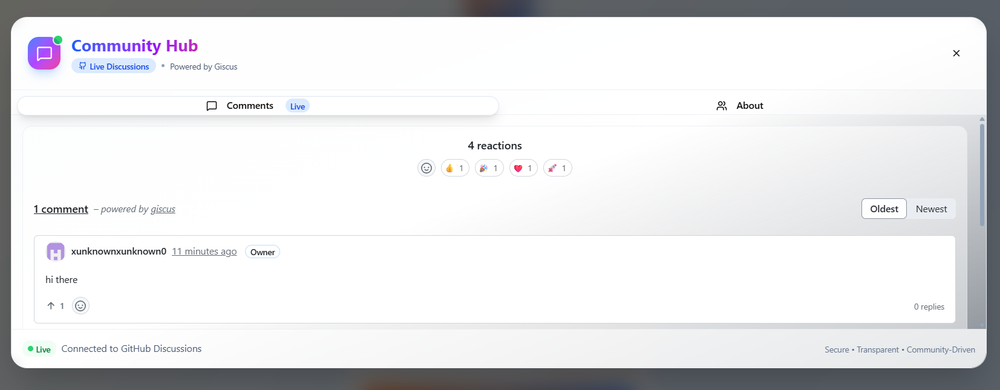
  <br/>
  <figcaption>Giscus Comment System Integrated in GitHub</figcaption>
</div>

---

### 📝 Embedded Giscus Widget

> 📌 *Note: GitHub README files **cannot execute scripts**, so the Giscus widget works only on GitHub Pages, your website, or inside your documentation site.  
> But you can still show the snippet below for developers.*

```html
<!-- Giscus Comment Embed -->
<script src="https://giscus.app/client.js"
        data-repo="YOUR_USERNAME/YOUR_REPO"
        data-repo-id="REPO_ID"
        data-category="General"
        data-category-id="CATEGORY_ID"
        data-mapping="pathname"
        data-strict="1"
        data-reactions-enabled="1"
        data-emit-metadata="0"
        data-input-position="bottom"
        data-theme="light"
        data-lang="en"
        crossorigin="anonymous"
        async>
</script>
```

## 🖥 Screenshots

### Auth Screens
<div align="center">
  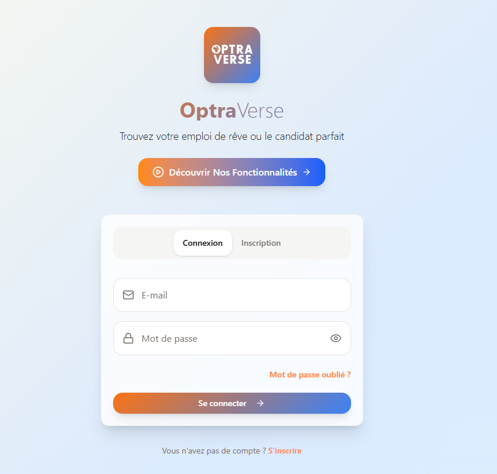
     <br/>
  <figcaption>Login Page</figcaption>
</div>

<div align="center">
  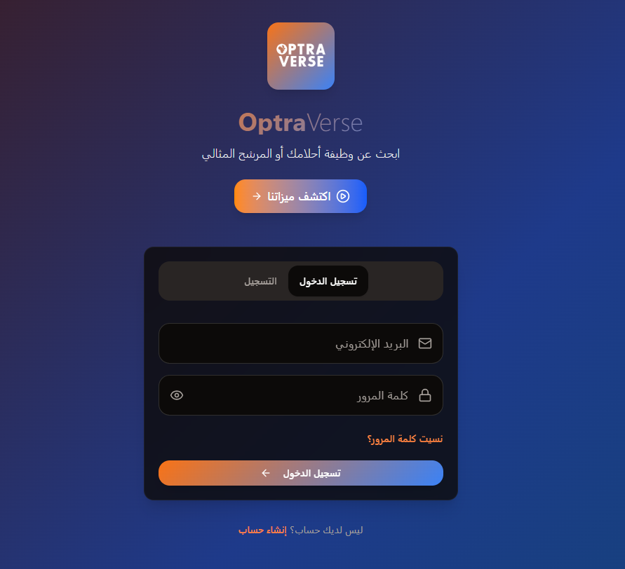
     <br/>
  <figcaption>Dark/Light Mode Toggle</figcaption>
</div>

<div align="center">
  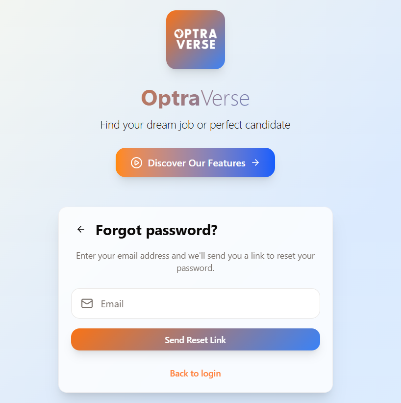
     <br/>
  <figcaption>Forget Password Flow</figcaption>
</div>

<div align="center">
  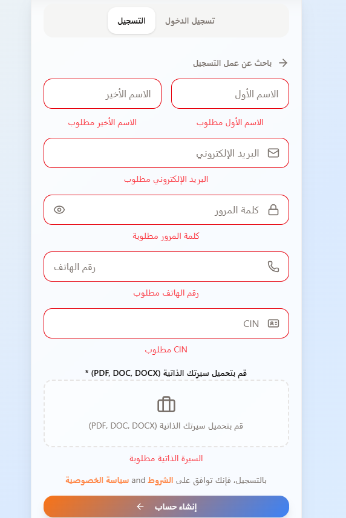
     <br/>
  <figcaption>Internationalization Flow</figcaption>
</div>

<div align="center">
  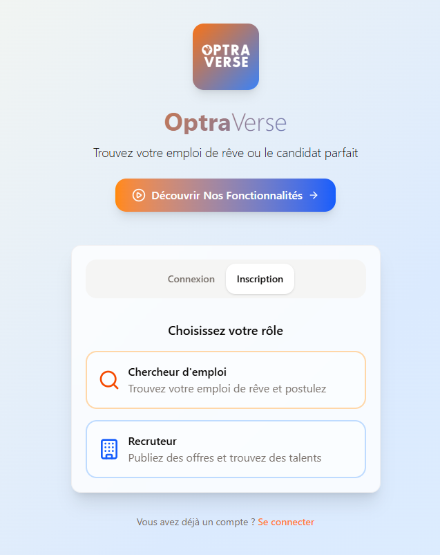
     <br/>
  <figcaption>Create Account</figcaption>
</div>

<div align="center">
  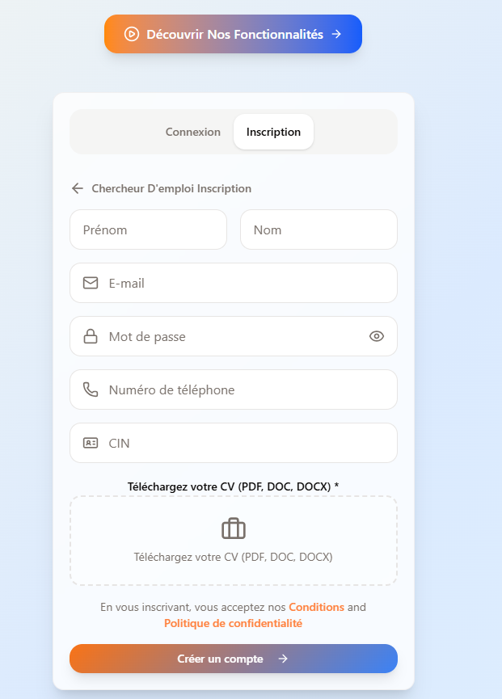
     <br/>
  <figcaption>Job Seeker Account Creation</figcaption>
</div>

<div align="center">
  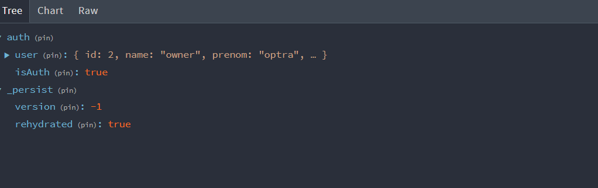
     <br/>
  <figcaption>Redux Toolkit 1</figcaption>
</div>

<div align="center">
  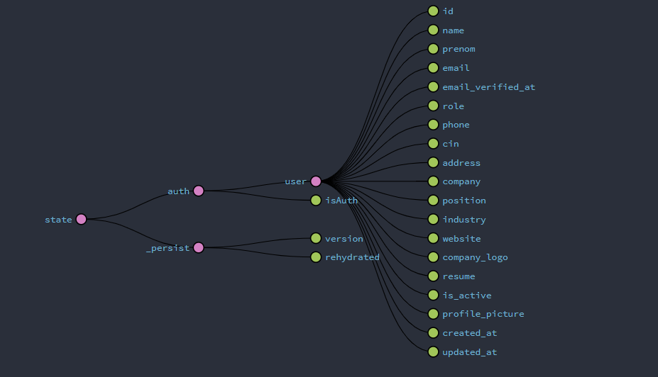
     <br/>
  <figcaption>Redux Toolkit 2</figcaption>
</div>

---

## 🏆 Vision
**Optra Verse** aims to become the **#1 career development platform** in Sub-Saharan Africa and MENA by leveraging **cutting-edge technology** to connect talent with opportunity efficiently and meaningfully.


## 🚀 <a name="contact">Contact us</a>

We welcome any questions, feedback, or inquiries related to OptraVerse. Please feel free to reach out to us through our email: optraverse@gmail.com

Visit the OptraVerse website [here](https://test/).

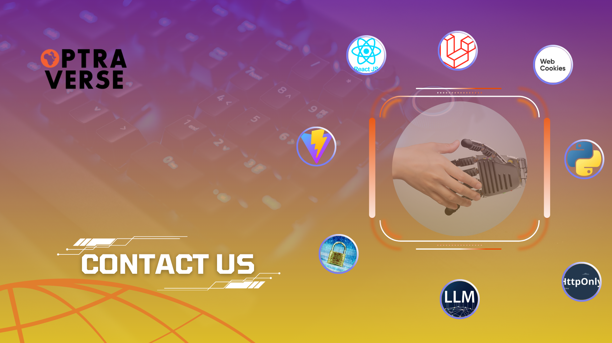
